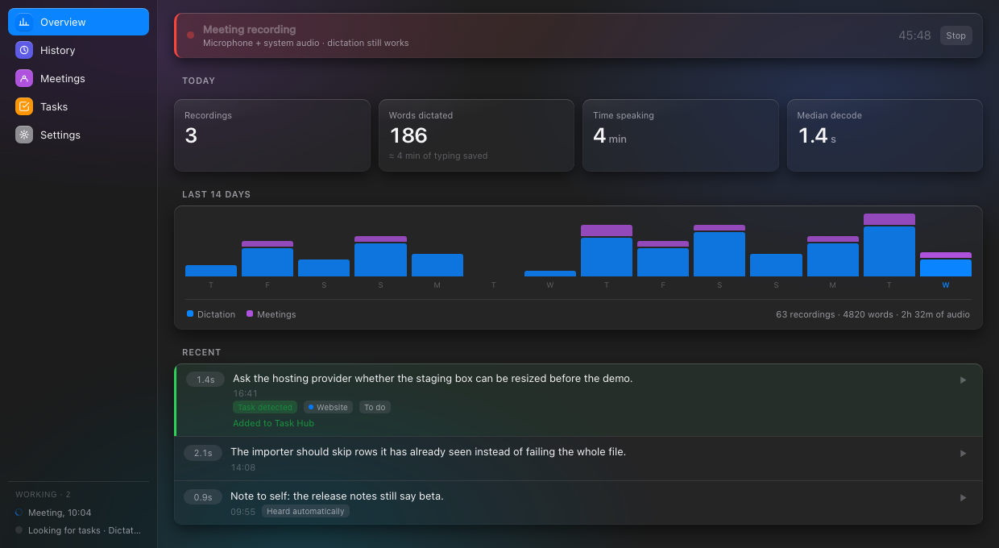
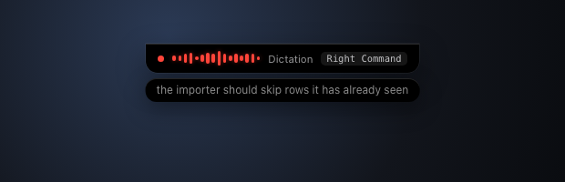
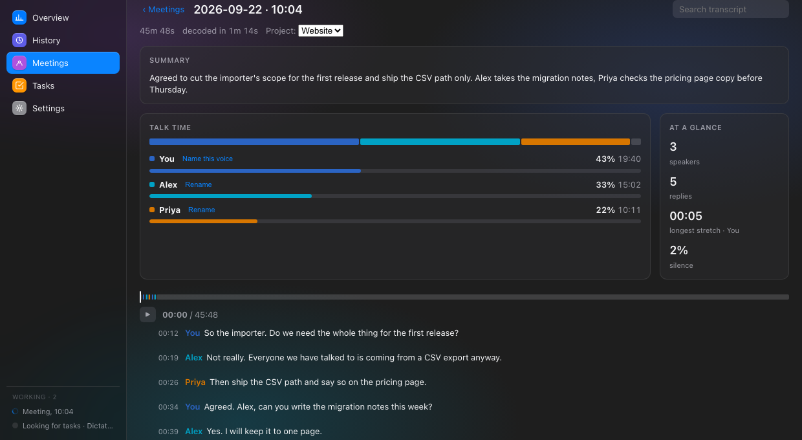
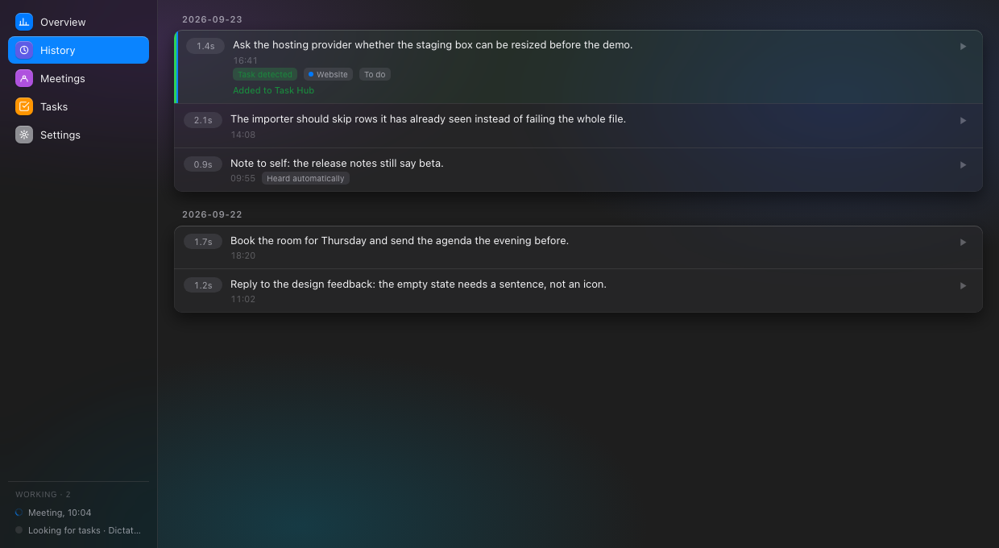
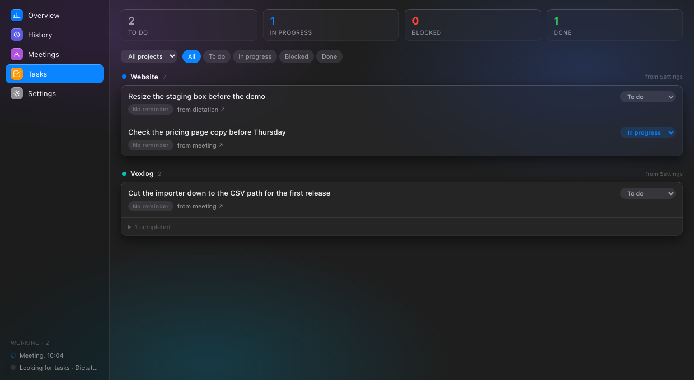
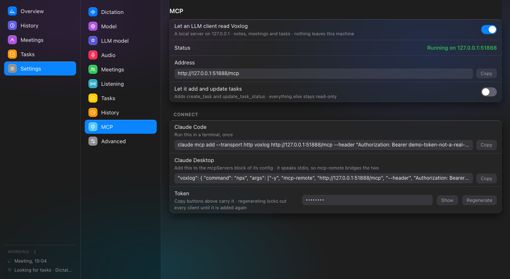

# Voxlog

**A menu bar dictation and meeting recorder for macOS that never talks to a server.**

Hold a key, speak, and the transcript lands in whatever app you were typing in.
Record a whole call and get it back as a transcript with the speakers told
apart. Everything — the speech models, the summaries, the search — runs on the
machine in front of you. No account, no upload, no network call the app makes
on its own except downloading a model you asked for.



`macOS 13+` · `Apple Silicon` · `Go + sherpa-onnx` · everything local

> The screenshots on this page are the real interface rendered with invented
> data — see [`tools/mkshots`](voxlog-go/tools/mkshots). Nobody's transcripts
> are in them.

---

## Install

1. Download `Voxlog.zip` from [the latest release](https://github.com/RKostuk/voxlog/releases/latest) and move `Voxlog.app` to `/Applications`.
2. The app is signed, but not by Apple — there is no Developer Program
   account behind it — so Gatekeeper will refuse it on first launch. Clear the
   quarantine flag once:

   ```sh
   xattr -dr com.apple.quarantine /Applications/Voxlog.app
   ```

   Or right-click the app, choose **Open**, and confirm.
3. Launch it. It lives in the menu bar; there is no Dock icon and no window
   until you ask for one.
4. Grant the permissions it asks for, then pick a model in **Settings →
   Model** and let it download. Nothing can be transcribed until one is on
   disk.

| Permission | Why | What happens without it |
|---|---|---|
| Accessibility | Global hotkeys | The event tap is created and silently never receives a key. This is the one that looks like the app is broken. |
| Microphone | Recording | Nothing records |
| Screen Recording | System audio | Meetings capture your side only — macOS treats audio-only capture as screen capture |

---

## What it does

### Dictation

Tap the dictate key to start, tap again to stop — or switch to hold-to-talk,
where the recording lasts exactly as long as the key is down. The transcript
is pasted into the focused app, copied, both, or neither. A hold shorter than
250 ms is thrown away rather than decoded: that was a key brushed on the way
to something else, not a sentence.



The indicator can sit beside the cursor, follow it, take a screen corner, or
drop into the strip the Dock lives in. The menu bar icon carries the state
too — red while the microphone is open, blue while a model is decoding.

### Hotkeys

A binding is either a single key tapped on its own — pressed and released with
nothing in between, which is what makes a bare right-Command binding usable —
or a combination, matched against the modifiers held when the key goes down.
Capture one in Settings by performing it; a key already used by another
binding is refused rather than silently taking over.

Escape cancels a recording in progress only if you turn that on. It gets
pressed constantly for unrelated reasons, and losing a take to a stray press
is worse than having no cancel key.

### Meetings

A second binding records a whole call for as long as it takes: microphone and
system audio together, written to disk as they arrive rather than held in
memory, so an hour costs about 115 MB of disk and nothing in RAM, and a crash
mid-call loses nothing.



With system audio on, the two sides are transcribed apart instead of mixed.
Far-end speakers are told apart with pyannote segmentation plus speaker
embeddings, and your own turns are interleaved with theirs in the order things
were said. Name a voice once and every meeting it appears in says that name.

Ordinary dictation keeps working during a meeting — same key, same overlay,
same paste. It listens in on the meeting's own capture rather than opening the
microphone twice, so the two can never drift apart.

### Always-on listening

Optional, off by default, and deliberately not "record everything": a
voice-activity model plus a second check decide when something is worth
opening a file for, so keyboard noise, music and a fan never do. What it hears
starts as a note and becomes a conversation only when a second voice has said
enough, and sounded different enough, to be another person.

There is a mute for it in the menu bar. It writes silence rather than dropping
samples — the two tracks are decoded against one clock — and it stops feeding
the gate too, so your own voice cannot keep a session you muted alive.

Whenever a recording of a call starts, by key or by itself, a banner reminds
you to tell the other people on it. That is courtesy everywhere and the law in
some places, and the only moment worth saying it is the moment it begins.

### History

One window, five sections. History lists past transcripts grouped by day,
newest first, each playable from the row it belongs to.



Press the History hotkey, walk the list with the arrow keys, press Enter, and
the line goes back into the field you were typing in — the window puts itself
away and hands focus back first. Clicking a row does whatever you set it to,
because a click is ambiguous in a way that gesture is not.

Old day files can be pruned after a week, two weeks or a month. Recordings
stay on disk until you ask for them to go: a Delete audio action on the row,
or Free up space in Settings, which sweeps by age or by a size ceiling.
Neither is on by default.

### Tasks

A local LLM reads each finished transcript and pulls out what sounded like a
commitment, filing it under one of your projects.



Everything here is optional and local too: the classifier runs on Apple's MLX
runtime, installed on first use rather than shipped in the app, and nothing is
sent anywhere. "Not a task" removes a line and remembers not to suggest it
again.

### Letting an LLM read it

Voxlog can serve its notes, meetings and tasks to an LLM client on the same
machine over the Model Context Protocol, so you can ask *"what did we decide
about the importer on Tuesday"* and get an answer out of your own recordings.



Off until you turn it on. When it is on it binds `127.0.0.1` and nothing else,
behind a bearer token kept in a file only you can read, and the pane hands you
the exact command to paste. The port it was given is remembered, so a client
configured once keeps working after a restart.

It reads by default. The two tools that add or move a task appear only if you
turn on the second switch, and nothing else about the app can be written from
outside it. Transcripts go out; the paths of the recordings behind them do
not.

```sh
claude mcp add --transport http voxlog http://127.0.0.1:51888/mcp \
  --header "Authorization: Bearer <token>"
```

---

## Models

| Model | Size | Notes |
|---|---|---|
| `parakeet tdt-0.6b-v3` | ~2.5 GB | The one to use. 25 European languages including Ukrainian, detected automatically. |
| `whisper large-v3` | ~1.8 GB | As accurate on the same audio, noticeably slower to decode. Takes an explicit language. |
| `nemotron streaming-320ms` | ~0.7 GB | The only one that can show text while you speak. Measurably less accurate: it substitutes words and truncates the last word of anything handed to it in pieces, which is inherent to a streaming model. |

A model that has not been downloaded cannot be selected. Settings can also
record once and run that recording through every downloaded model, so the
choice is made on your own voice rather than on a benchmark.

Transcription runs on its own queue: the next take can start while earlier
ones are still decoding, the shortest recording goes first, and a long one
hands over between blocks — so a ten-second remark dictated during a meeting
is decoded in the middle of that meeting's hour of audio, not after it.

---

## Privacy

- No network call the app makes on its own, ever, except downloading a model
  or the MLX runtime you asked for.
- Recordings and transcripts live in `~/Documents/Voxlog`; the database, the
  settings and the MCP token live in `~/Library/Application Support/Voxlog`.
- The MCP server is off by default, binds loopback only, and answers a wrong
  token with a 404 rather than a 401 — a caller cannot tell a bad token from a
  server that was never there.
- Always-on listening is off by default, and has a mute that survives the
  session it was clicked in.

---

## Building

```sh
cd voxlog-go
make build     # binary
make bundle    # ../Voxlog.app, signed
make dist      # ../Voxlog.zip, via ditto
make icons     # regenerate AppIcon.icns and the menu bar glyphs
go test ./...
```

`bundle` copies the two sherpa-onnx dylibs into `Contents/Frameworks` and
repoints the rpath at them. Without that the app runs only on the machine that
built it: the linker records an rpath into the local Go module cache.

Signing uses whatever codesigning identity is on the machine, falling back to
ad-hoc. macOS keys Accessibility and Screen Recording permissions to the
signature, so a stable identity means grants survive a rebuild — the Makefile
explains how to make one, no Apple account needed.

Icons are generated by `tools/mkicons` rather than from SVG, because
qlmanage — the only SVG rasterizer macOS ships — flattens transparency onto
white, which renders a menu bar template image as a solid black rectangle.
Screenshots are generated by `tools/mkshots`, which splices the same page the
webview gets and fills it with invented data.

---

## Layout

| Package | What lives there |
|---|---|
| `internal/audio` | Microphone capture via malgo, level metering, device volume, WAV files, block splitting |
| `internal/systemaudio` | System audio capture via ScreenCaptureKit |
| `internal/asr` | sherpa-onnx recognizers, model download and layout |
| `internal/vad` | The voice-activity gate always-on listens through |
| `internal/diarize` | Speaker segmentation and clustering |
| `internal/voiceid` | Speaker embeddings, and telling one voice from another |
| `internal/history` | Per-day transcript files, the meetings database, retention |
| `internal/task` | Tasks, one JSON file each |
| `internal/llm` | The local MLX classifier and its runtime |
| `internal/mcp` | The MCP server: JSON-RPC over loopback HTTP, and its tools |
| `internal/hotkey` | CGEventTap listener, bindings, key labels |
| `internal/output` | Clipboard and simulated paste, via NSPasteboard |
| `internal/permissions` | TCC status checks |
| `internal/usernotify` | Notification banners, and routing a click on one back into the app |
| `internal/settings` | JSON settings under Application Support |
| `internal/ui` | The three webview windows, and the AppKit calls behind them |

At the top level, alongside `main.go`: `app.go` holds the state a hotkey press
acts on, `dictate.go` and `meeting.go` are the two kinds of recording session,
`alwayson.go` and `session.go` are the third, `transcribe.go` turns a finished
recording into text, `decodequeue.go` decides what gets decoded next, and
`tray.go` derives the menu bar from everything happening at once.

---

## Notes

- A panic during dictation is caught, logged with its stack, and surfaced as a
  notification rather than taking the app down. `~/Library/Logs/Voxlog.log`
  gets the process's stderr too, so a traceback has somewhere to land — a
  bundled app launched from Finder has fd 2 on `/dev/null`.
- No CoreML or Neural Engine: the linked sherpa-onnx exposes no such provider,
  so everything runs on CPU.
- The level meters read **peak**, not average, on a dBFS scale from -40 to
  -6, and hold the loudest moment between reads so a transient cannot slip
  between two of them. They rise instantly and fall on a fixed slope, which is
  what a peak meter has always done.
- Text goes to the clipboard through NSPasteboard, not `pbcopy`. pbcopy takes
  no encoding argument and decodes stdin using the environment's locale; an
  app launched from Finder has no `LANG`, so it fell back to MacRoman and
  turned every Cyrillic transcript into mojibake.
- Native Go rewrite of the original Python/rumps app, which lived in this repo
  until commit `723c673`.
